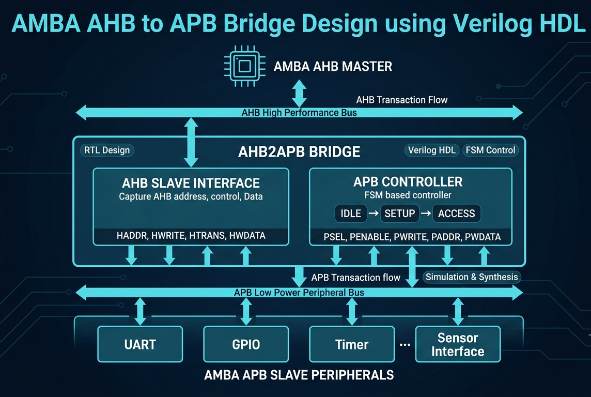
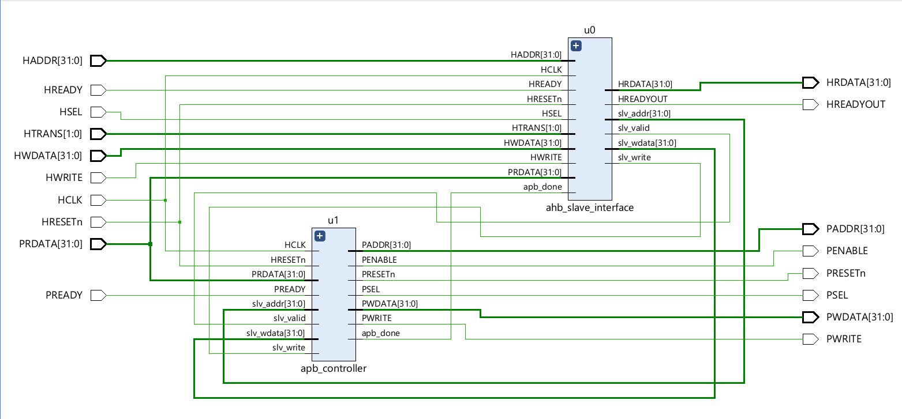
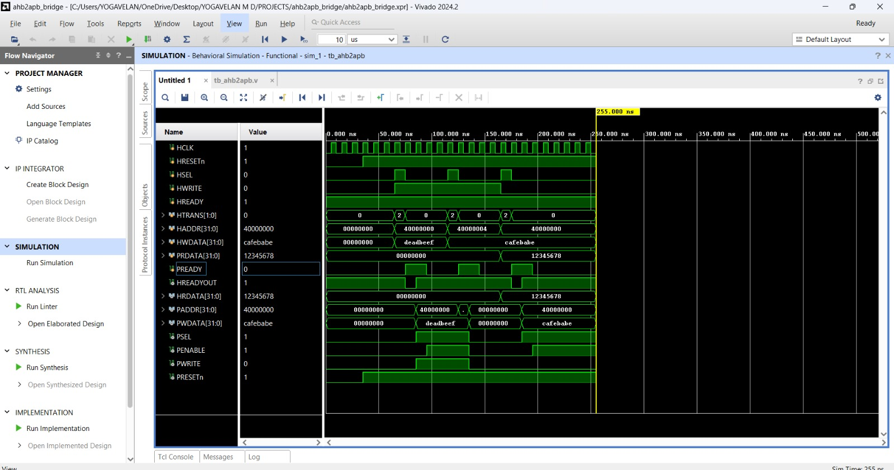

# AMBA AHB2APB Bridge Design using Verilog HDL

## Project Overview

This project focuses on the design and verification of an **AMBA AHB to APB Bridge** using **Verilog HDL**.

The bridge acts as an interface between the high-performance **AMBA AHB (Advanced High-performance Bus)** and the low-power **AMBA APB (Advanced Peripheral Bus)**. It converts AHB transactions into APB-compatible transactions to enable communication between high-speed processors and peripheral devices.

The design includes an **AHB Slave Interface**, an **APB Controller**, and a **Finite State Machine (FSM)** based control mechanism for managing APB transfer operations.

## Objectives

- Design an RTL-based AHB to APB bridge using Verilog HDL.
- Implement FSM-based APB transaction control.
- Verify the functionality using simulation testbench.
- Perform synthesis analysis and evaluate hardware utilization.

## Features

- AMBA AHB Slave Interface
- AMBA APB Master Controller
- FSM based APB transfer sequencing
- Support for Read and Write transactions
- RTL simulation and waveform verification
- FPGA synthesis analysis using Vivado

## System Architecture

The AMBA AHB2APB Bridge acts as an interface between the high-performance AHB bus and low-power APB peripheral bus.

### Conceptual Architecture

### RTL Block Diagram (Vivado Elaborated Design)

## FSM Operation

The APB Controller uses a three-state FSM to control APB transactions.

### States:

**IDLE**
- No APB transaction is active.
- Controller waits for a valid AHB request.

**SETUP**
- APB select signal (PSEL) is asserted.
- Address and control signals are transferred.

**ACCESS**
- PENABLE is asserted.
- APB peripheral performs read/write operation.

FSM Flow:

IDLE → SETUP → ACCESS → IDLE

## RTL Modules

| Module | Description |
|---|---|
| ahb_slave_interface.v | Handles AHB transactions |
| apb_controller.v | Generates APB control signals |
| ahb2apb_bridge.v | Top module connecting AHB and APB |
| tb_ahb2apb.v | Verification testbench |

## Simulation Results

The design was verified using Vivado simulation. The waveform confirms correct conversion of AHB transactions into APB transactions.

## Synthesis Results

The design was synthesized using Xilinx Vivado.

### Resource Utilization

| Resource | Usage |
|---|---|
| LUTs | 37 |
| Flip-Flops | 69 |

### Timing Analysis

- Worst Negative Slack (WNS): 8.812 ns
- Timing Status: MET

## Tools Used

- Verilog HDL
- Xilinx Vivado Design Suite
- RTL Simulation
- FPGA Synthesis

## Author

**Yogavelan M D**
